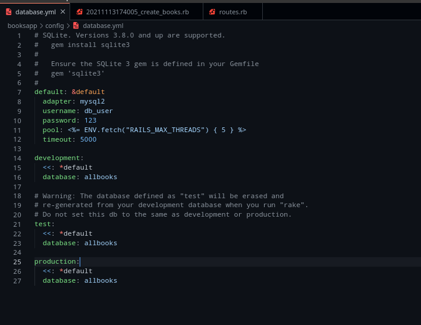
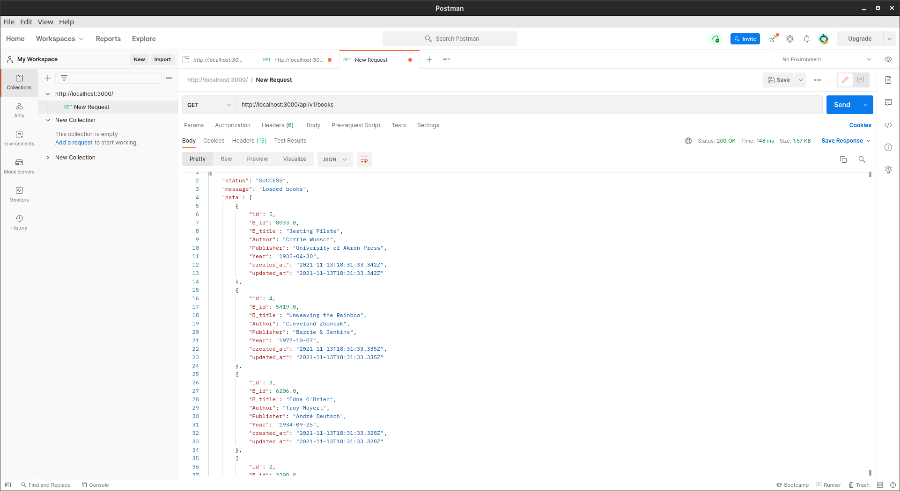
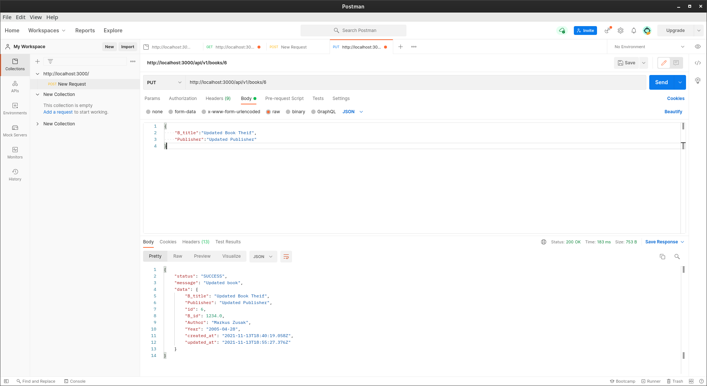

<h1>
    <center>WEB PROGRAMMING</center>
    <center>CRUD API - Ruby On Rails</center>
</h1>
<h3>
<center> <bold>Submitted by:</bold> Group 3</center>
</h3>
<ul>
    <li> Soujanya Namburi </li>
    <li> Sreelakshmi K </li>
    <li> Ajay P Sakthikumar </li>
</ul>
<hr /> 

[Click here for the code](https://github.com/soujanyanmbri/rubyonrails_webp)

## STEPS: 

1. Create the application 

```
rails new booksapp --api
cd booksapp
```
2. Set up the database:

We are using mysql2 instead of sqlite3, so make the following change in the Gemfile. 

```
# gem 'sqlite3'
gem 'mysql2'
```
Make the following changes to database.yml file as well 
 


3. We use the MVC (Model View Controller) Architecture here. We create a model Book with the given attributes. 
```
Book[B_id, B_title, Author, Publisher, Year]
```
PS. we will have another id element in the database. That is used to perform the CRUD operations. B_id is a different attribute

Run the following command to create a model: 
```
rails g model Book B_title Author Year Publisher
```
The following files will be created on running the command: 

        a. app/models/books.rb
        b. db/migrate/[date_time]_create_books.rb

This is the final schema: (In db/migrate/schema.rb)
 

4.  Now that we created the database with appropriate columns, we migrate it to the actual database using the following command: 

```
rails db:migrate
```
5. We could also initiate values by editing the db/migrate/seeds.rb file. We have used an external library to make dummy values on which we could work on.  

```
5.times do
    Book.create({
        B_id: Faker::Number.number(digits: 4),
        B_title: Faker::Book.title,
        Author: Faker::Book.author,
        Publisher: Faker::Book.publisher,
        Year: Faker::Date.between(from: '1900-09-23', to: '2014-09-25'),
    })
end
```
This can be initialised using the following command: 
```
rails db:seed
```

6. Make an api folder in the app/controllers folder with the following contents: v1/books_controller.rb

```
module Api
    module V1
        class BooksController < ApplicationController
            def index
                books = Book.order('created_at DESC');
                render json: {status: 'SUCCESS', message:'Loaded books', data:books},status: :ok
            end

            def show
                book = Book.find(params[:id])
                render json: {status: 'SUCCESS', message:'Loaded book', data:book},status: :ok
            end

            def create
                book = Book.new(book_params)

                if book.save
                    render json: {status: 'SUCCESS', message:'Saved book', data:book},status: :ok
                else
                    render json: {status: 'ERROR', message:'book not saved', data:book.errors},status: :unprocessable_entity
                end
            end

            def destroy
                book = Book.find(params[:id])
                book.destroy
                render json: {status: 'SUCCESS', message:'Deleted book', data:book},status: :ok
            end

            def update
                book = Book.find(params[:id])
                if book.update(book_params)
                    render json: {status: 'SUCCESS', message:'Updated book', data:book},status: :ok
                else
                    render json: {status: 'ERROR', message:'book not updated', data:book.errors},status: :unprocessable_entity
                end
            end

            private

            def book_params
                params.permit(:B_id, :B_title, :Author, :Publisher, :Year)
            end
        end
    end
  end
```

Define the above methods
 
7. Edit the routes.rb file to update the versions. The versions are made to made the API more scalable, config/routes.rb

```
Rails.application.routes.draw do
  namespace 'api' do
    namespace 'v1' do
      resources :books
    end
  end
end
```

8. The API is ready. Run the app using the following command: 

```
rails s
```
9. Give the below requests using POSTMAN or any other services

### GET ALL
 

### GET with certain ID
 

### POST
 

### DELETE
 

### UPDATE
 
